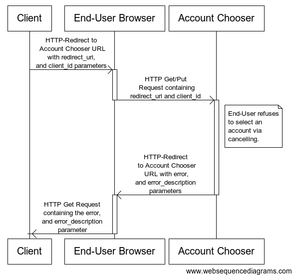

# OpenID Connect Client - Account Chooser UI Application Protocol

## Overview 

This Client - Account Chooser Protocol proposed in response to [Issue #39].

#### Authorization when using Account Chooser Code Flow

The Authorization when using Account Chooser Code Flow goes through the following steps:

1. Client prepares an Account Chooser Request containing the desired request parameters.
2. Client sends a request to the Account Chooser.
3. Account Chooser presents a selection of OpenID Connect (OIDC) Servers from which the End-User must select from.
4. End-User selects an OIDC.
5. Account Chooser Sends the End-User back to the Client with key value of the OIDC End-User selected.
6. The Client begins the Authorization flow described in [Authorization Code Flow][OpenID Connect Standard] of the [OpenID Connect Standard].

#### Account Chooser Request

When the End-User wishes to access a Protected Resource and the End-User Authorization has not yet been obtained, the Client will redirect the End-User to Account Chooser.

Account Chooser MUST support the use of the HTTP "GET" and "POST" methods defined in RFC 2616 [RFC2616]. 

Clients MAY use the HTTP "GET" or "POST" method to send the Account Chooser Request to the Account Chooser. If using the HTTP "GET" method, the request parameters are serialized using URI query string serialization. If using the HTTP "POST" method, the request parameters are serialized using form serialization. 

#### Client Prepares an Account Chooser Request

The Client prepares an Account Chooser Request to the Account Chooser with the request parameters using the HTTP "GET" or "POST" method.

The required Account Chooser Request parameters are as follows: 

* redirect_uri - REQUIRED. A redirection URI where the response will be sent.
* client_id - REQUIRED. An identifier used to identify the Client to the Account Chooser UI application. 

There is one method to construct and send the request to the Account Chooser:

* Simple Request Method 

#### Simple Request Method

The Client prepares an Account Chooser Request to the Account Chooser using the appropriate parameters. If using the HTTP "GET" method, the request parameters are serialized using URI query string serialization. If using the HTTP "POST" method, the request parameters are serialized using form serialization. 

The following is a non-normative example of an Account Chooser Request URL. Line wraps are for display purposes only. 

	http://server.example.com/chooser?
	redirect_uri=https%3A%2F%2Fclient.example.com%2Fopenid_connect_login
	&client_id=FGWEUIASJK
	
#### Client sends a request to the Account Chooser

Having constructed the Account Chooser Request, the Client sends it to the Account Chooser. This MAY happen via redirect, hyperlinking, or any other means of directing the User-Agent to the Account Chooser URL.

Following is a non-normative example using HTTP redirect. Line wraps are for display purposes only.

	HTTP/1.1 302 Found
	Location: https://server.example.com/chooser?
	redirect_uri=https%3A%2F%2Fclient.example.com%2Fopenid_connect_login
	&client_id=FGWEUIASJK

#### Account Chooser Sends the End-User back to the Client

After the End-User has select an OpenID Connect Server, the Client issues an Account Chooser Response and delivers it to the Client by adding the response parameters to redirect_uri specified in the Account Choose Request using the "application/x-www-form-urlencoded" format. 

The following response parameters are included:

* issuer - REQUIRED.  The [Issuer Identifier] describing the selected account.

The following is non-normative example of a responses. Line wraps are for display purposes only. 

	HTTP/1.1 302 Found
	Location: https://client.example.com/openid_connect_login?
	issuer=http%3A%2F%2Fsever.example.com%3A8080%2Fopenid-connect-server
	
A sequence diagram of a successful interaction would be:

	

#### The Client ID is not Supported by the Account Chooser Application

If the Client sends a Client identifier that is not supported by the Account Chooser UI application, the Account Chooser MUST return an error response back to the End-User by issuing a HTTP Response with a message concerning the error. The Account Chooser MUST NOT directly return to the Client via the redirection URI specified in the Account Chooser Request automatically. 

The error message the Account Chooser presents to the End-User MAY give the End-User the means to return the  indication of an error to the Client, e.g., via the End-User clicking on a HTML link built from adding the error parameters to the query component of the redirection URI. No other parameters SHOULD be returned.

The error response parameters are the following:

* error - REQUIRED. The error code. 
* error_description - OPTIONAL. A human-readable UTF-8 encoded text description of the error. 

The response parameters are added to the query component of the redirection URI specified in the Account Chooser Request.

The following is a non-normative example. Line wraps after the second line are for the display purposes only.

	https://client.example.com/openid_connect_login?
	error=not_supported
	&error_description=The%20client_id%20is%20not%20supported%20by%20the%20AccountChooser%20UI%20application.
	
A sequence diagram of the interaction where the Account Chooser was not configured to support the Client would be:

		
 
#### End-User refuses to select an Account

If the End-User refuses to select an Account, the Account Chooser MUST return an error response. The Account Chooser returns the Client via the redirection URI specified in the Account Chooser Request with the appropriate error parameters. No other parameters SHOULD be returned.

The error response parameters are the following:

* error - REQUIRED. The error code. 
* error_description - OPTIONAL. A human-readable UTF-8 encoded text description of the error. 

The response parameters are added to the query component of the redirection URI specified in the Account Chooser Request.

The following is a non-normative example. Line wraps after the second line are for the display purposes only.

	HTTP/1.1 302 Found
	Location: https://client.example.com/openid_connect_login?
	error=end_user_cancelled
	&error_description=The%20end%2Duser%20refused%20to%20select%20an%20Account.
	
A sequence diagram of an interaction where the End-User refused to select an Account would be:

		

[OpenID Connect Standard]: http://openid.net/specs/openid-connect-standard-1_0.html "OpenID Connect Standard 1.0"
[OpenID Connect Standard]: http://openid.net/specs/openid-connect-standard-1_0.html#code_flow "Authorization Code Flow, OpenID Connect Standard"
[Issuer Identifier]: http://openid.net/specs/openid-connect-messages-1_0.html#issuer_identifier "Issuer Identifier"
[Issue #39]: http://github.com/jricher/OpenID-Connect-Java-Spring-Server/issues/39 "Issue #39 -- Multiple Point Client"